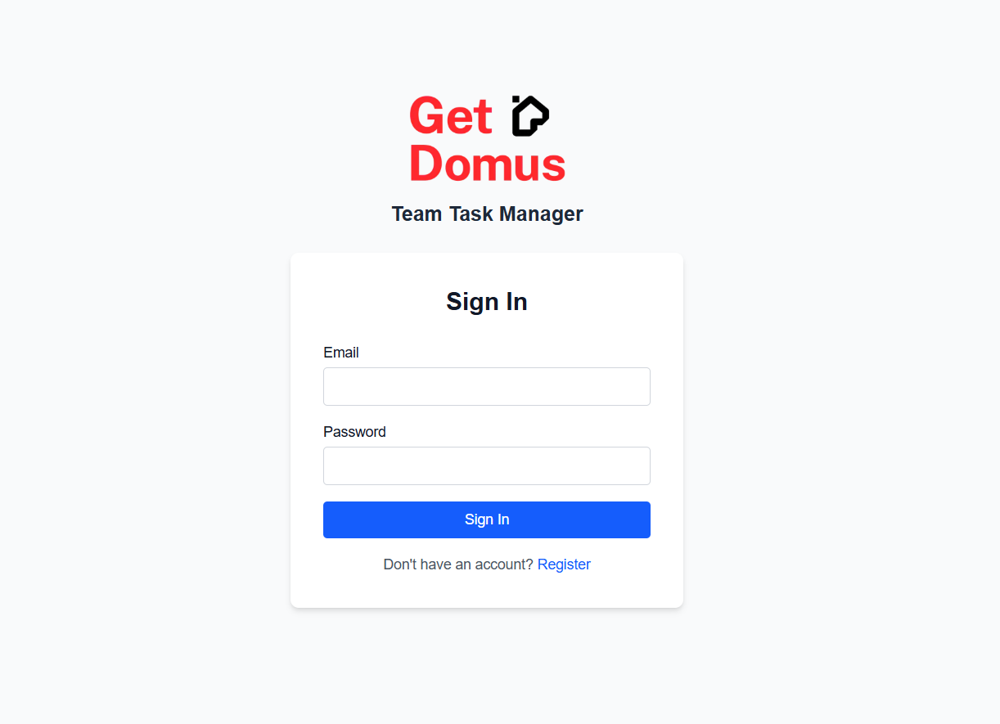
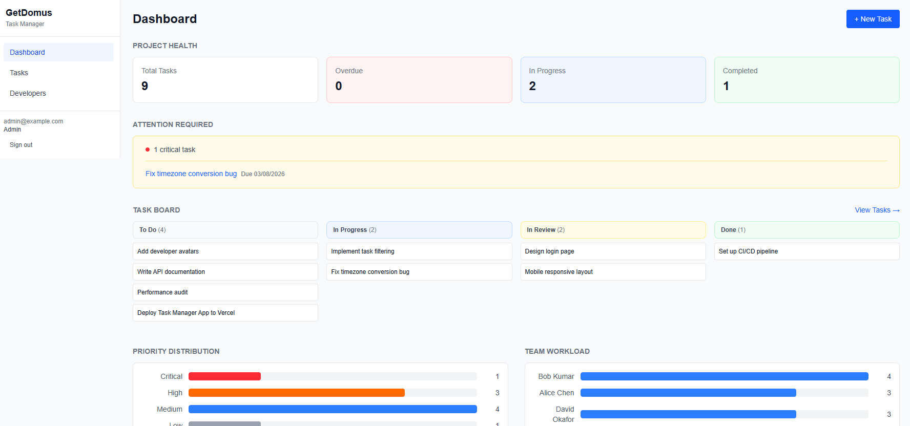
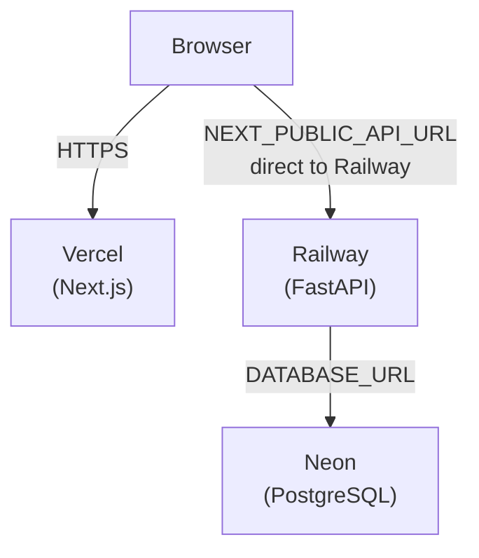

<div align="center">

# GetDomus Team Task Manager

> Task management app for distributed engineering teams supporting multi-developer
> assignment, timezone awareness, and role-based access control.
</div>



<!-- PLACEHOLDER: Replace with actual screenshot after deployment -->

## Live Demo

- 🔗 **Frontend:** [https://getdomus-team-task-manager.vercel.app](https://getdomus-team-task-manager.vercel.app)
- 🔧 **Backend:** [https://getdomusteamtaskmanager-production.up.railway.app](https://getdomusteamtaskmanager-production.up.railway.app)
- 📖 **Documentation:** [https://bigmikecreates.github.io/getdomus_team_task_manager](https://bigmikecreates.github.io/getdomus_team_task_manager)
- 🔑 **API Docs:** [Swagger UI](https://getdomusteamtaskmanager-production.up.railway.app/docs)

## Tech Stack

| Layer | Technology | Purpose |
|-------|-----------|---------|
| Frontend | Next.js 16 + TypeScript | SPA with App Router |
| UI | Tailwind CSS 4 | Utility-first styling |
| Data | TanStack Query | Server state management |
| Backend | FastAPI (async) | REST API |
| ORM | SQLAlchemy 2.0 (async) | Database access |
| Database | PostgreSQL 16 | Persistent storage |
| Auth | JWT (python-jose) + bcrypt | RBAC with 3 roles |
| Containerization | Docker + Docker Compose | Local & production |
| CI/CD | GitHub Actions | Test + build on PR |
| Docs | MKDocs + Material theme | Documentation site |

## Features

- **Task Management** — Create, read, update, delete tasks with status and priority tracking
- **Multi-Assignment** — Assign multiple developers to a single task
- **Role-Based Access** — Admin, Manager, Developer roles with different permissions
- **Timezone Awareness** — View each developer's local time and working hours
- **Online/Offline Presence** — Heartbeat-based presence tracking with availability indicators
- **Dashboard** — Stats, overdue alerts, critical task highlights, upcoming deadlines
- **Sortable Task List** — Sort by status, priority, due date, or assignee count
- **Responsive Design** — Mobile-friendly with collapsible sidebar

## Architecture



See [Architecture Documentation](docs/technical/architecture.md) for full system design.

## Quick Start

### Prerequisites

- Python 3.14+
- Node.js 20+
- Docker & Docker Compose

### Setup

```bash
# Clone
git clone https://github.com/bigmikecreates/getdomus_team_task_manager.git
cd getdomus_team_task_manager

# Backend
python -m venv .venv
source .venv/bin/activate      # macOS/Linux
# .venv\Scripts\activate       # Windows
pip install -e ".[dev]"

# Frontend
cd frontend && npm install && cd ..

# Database
docker compose up -d
alembic upgrade head
python -m backend.seed

# Start servers
uvicorn backend.main:app --reload          # Backend → http://localhost:8000
cd frontend && npm run dev                 # Frontend → http://localhost:3000
```

Open [http://localhost:3000](http://localhost:3000)

### Test Accounts

| Email | Password | Role |
|-------|----------|------|
| admin@example.com | admin123 | admin |
| manager@example.com | manager123 | manager |
| dev@example.com | dev123 | developer |

## Testing

```bash
# Backend — 111 tests (TDD)
python -m pytest -v

# Frontend — 38 tests (behavior-focused)
cd frontend && npm run test

# Full build check
cd frontend && npm run build
```

## API Endpoints

| Method | Endpoint | Auth | Description |
|--------|----------|------|-------------|
| `POST` | `/api/auth/login` | — | Login, returns JWT |
| `GET` | `/api/tasks` | Bearer | List tasks |
| `POST` | `/api/tasks` | Admin/Manager | Create task |
| `PUT` | `/api/tasks/{id}` | Admin/Manager | Update task |
| `DELETE` | `/api/tasks/{id}` | Admin/Manager | Delete task |
| `POST` | `/api/tasks/{id}/assign` | Admin/Manager | Assign developers |
| `GET` | `/api/developers` | Bearer | List developers + availability |
| `POST` | `/api/developers` | Admin | Create developer |
| `GET` | `/api/dashboard/overview` | Bearer | Dashboard summary |
| `POST` | `/api/presence/heartbeat` | Bearer | Record heartbeat |

Full API reference: [docs/technical/api/reference.md](docs/technical/api/reference.md)

## Project Structure

```
getdomus_team_task_manager/
├── backend/
│   ├── api/v1/            # Route handlers (auth, tasks, developers, dashboard, presence)
│   ├── services/          # Business logic
│   ├── repositories/      # Database queries
│   ├── models/            # SQLAlchemy ORM models
│   ├── schemas/           # Pydantic request/response schemas
│   ├── core/              # Config, security, DB, dependencies, timezone utils
│   └── tests/             # 111 tests (TDD)
├── frontend/
│   ├── src/app/           # App Router pages (auth + dashboard route groups)
│   ├── src/components/    # Shared components (sidebar, error boundary, multiselect)
│   ├── src/lib/           # API client, auth, labels
│   └── src/__tests__/     # 27 tests (behavior-focused)
├── docs/                  # MKDocs documentation site
│   ├── user-guide/        # Non-technical walkthroughs (Manager, Developer, Admin)
│   └── technical/         # Setup, architecture, API reference, deployment
├── assets/                # Static assets (screenshots, images)
├── alembic/               # Database migrations
├── scripts/               # API docs generator
├── .github/workflows/     # CI (test + build on PR)
├── docker-compose.yml     # Full stack (backend + frontend + PostgreSQL)
├── mkdocs.yml             # Documentation config
└── pyproject.toml         # Python project config
```

## Documentation

Full documentation is available in the [docs/](docs/index.md) folder:

- **[User Guide](docs/user-guide/index.md)** — Role-oriented walkthroughs (Manager, Developer, Admin)
- **[Technical Guide](docs/technical/index.md)** — Setup, testing, architecture, deployment
- **[API Reference](docs/technical/api/reference.md)** — Auto-generated endpoint docs

To preview docs locally:

```bash
pip install mkdocs-material mkdocs-mermaid2-plugin
mkdocs serve
# → http://localhost:8000
```

## Key Decisions

| Decision | Rationale |
|----------|-----------|
| Async SQLAlchemy + asyncpg | FastAPI is async-native; blocking DB calls would bottleneck |
| Repository + Service pattern | Testability — services tested with mock repos |
| JWT with HTTPBearer | Simpler for SPA clients than OAuth2 flow |
| SQLite for tests, PostgreSQL for dev | Fast tests without Docker; prod parity in dev |
| Direct browser-to-backend API | Browser calls Railway directly via `NEXT_PUBLIC_API_URL` |
| `npm install` over `npm ci` in CI | Cross-platform lock file compatibility |

See [Architectural Decisions](docs/technical/decisions.md) for full rationale.

## License

Proprietary — GetDomus Graduate Full-Stack Technical Assessment. All rights reserved.
