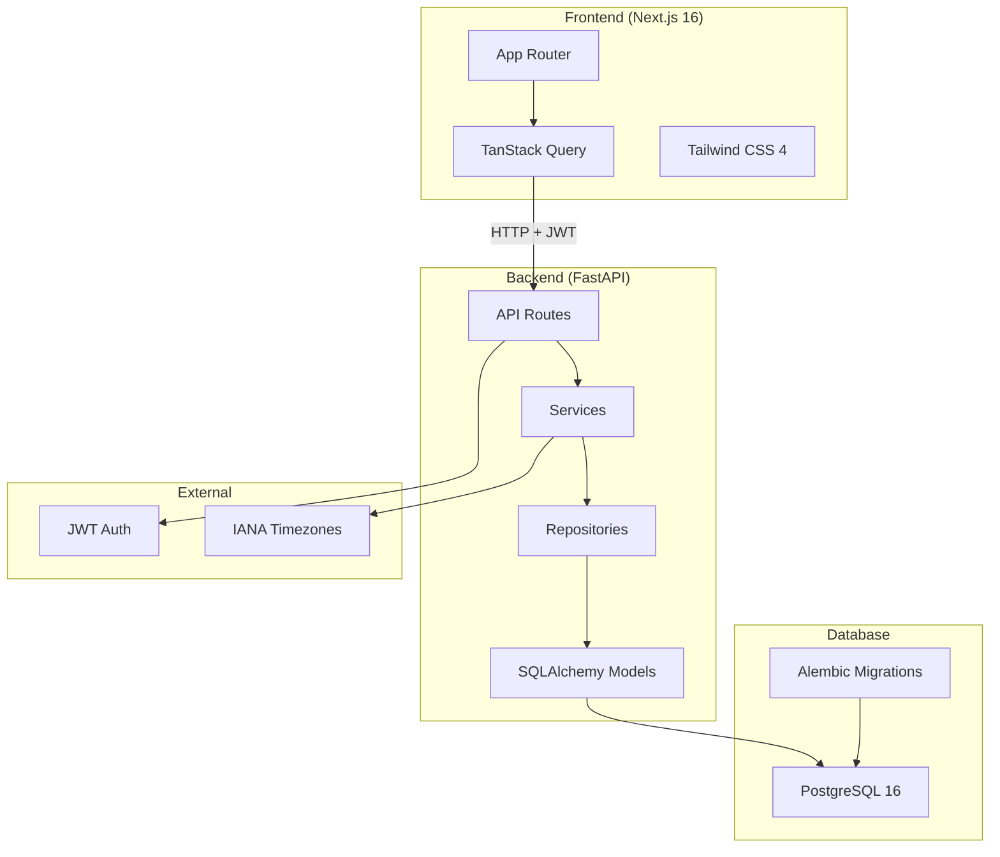
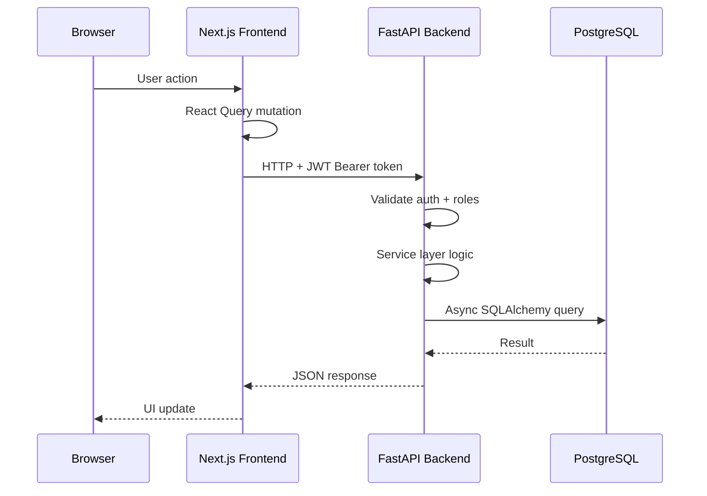
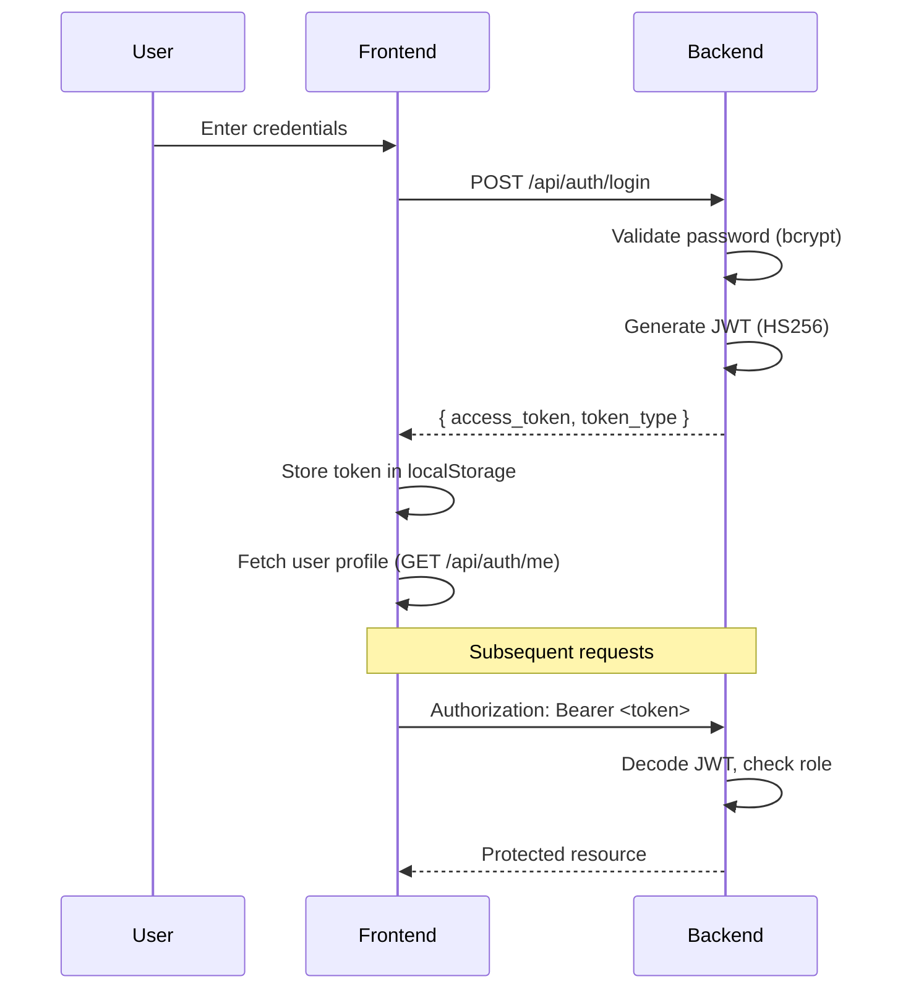

# Architecture

## System Overview



## Tech Stack

| Layer | Technology | Version | Purpose |
|-------|-----------|---------|---------|
| Frontend | Next.js | 16.2.10 | React framework (App Router) |
| UI | Tailwind CSS | 4 | Utility-first styling |
| Data | TanStack Query | 5.x | Server state management |
| Backend | FastAPI | Latest | Async REST API |
| ORM | SQLAlchemy | 2.0+ | Async database access |
| Migrations | Alembic | Latest | Schema versioning |
| Database | PostgreSQL | 16 | Persistent storage |
| Auth | JWT | — | python-jose + bcrypt |
| Timezone | zoneinfo | — | IANA timezone support |

## Backend Structure

```
backend/
  api/v1/            Route handlers
    auth.py          POST /register, /login, GET /me
    tasks.py         CRUD + assign/unassign
    developers.py    CRUD + availability
    dashboard.py     Stats + overview
    presence.py      Heartbeat endpoint
  services/          Business logic
    auth_service.py
    task_service.py
    developer_service.py
    dashboard_service.py
    presence_service.py
  repositories/      Database queries
    task_repository.py
    developer_repository.py
    user_repository.py
  models/            SQLAlchemy ORM models
    user.py
    developer.py
    task.py
    task_assignment.py
  schemas/           Pydantic request/response
    auth.py
    task.py
    developer.py
    dashboard.py
  core/              Infrastructure
    config.py        Environment settings
    database.py      Async engine + session
    security.py      JWT + password hashing
    dependencies.py  Auth + role dependencies
    timezone_utils.py  IANA timezone conversion
  main.py            FastAPI app entry point
```

## Frontend Structure

```
frontend/src/
  app/
    (auth)/          Authentication pages
      login/
      register/
    (dashboard)/     Main app pages
      page.tsx       Dashboard
      tasks/         Task list, create, edit, detail
      developers/    Developer list, create
  components/        Shared components
    sidebar.tsx
    error-boundary.tsx
    developer-multiselect.tsx
  lib/
    api.ts           API client (fetch wrapper)
    auth.tsx         AuthProvider + useAuth hook
    labels.ts        Shared status/priority labels
  __tests__/         Frontend tests + MSW mocks
```

## Data Flow



## Auth Flow



## RBAC Permissions

| Endpoint | Admin | Manager | Developer |
|----------|:-----:|:-------:|:---------:|
| `POST /api/tasks` | ✅ | ✅ | ❌ |
| `PUT /api/tasks/{id}` | ✅ | ✅ | ❌ |
| `DELETE /api/tasks/{id}` | ✅ | ✅ | ❌ |
| `POST /api/tasks/{id}/assign` | ✅ | ✅ | ❌ |
| `POST /api/developers` | ✅ | ❌ | ❌ |
| `PUT /api/developers/{id}` | ✅ | ❌ | ❌ |
| `DELETE /api/developers/{id}` | ✅ | ❌ | ❌ |
| All read endpoints | ✅ | ✅ | ✅ |
