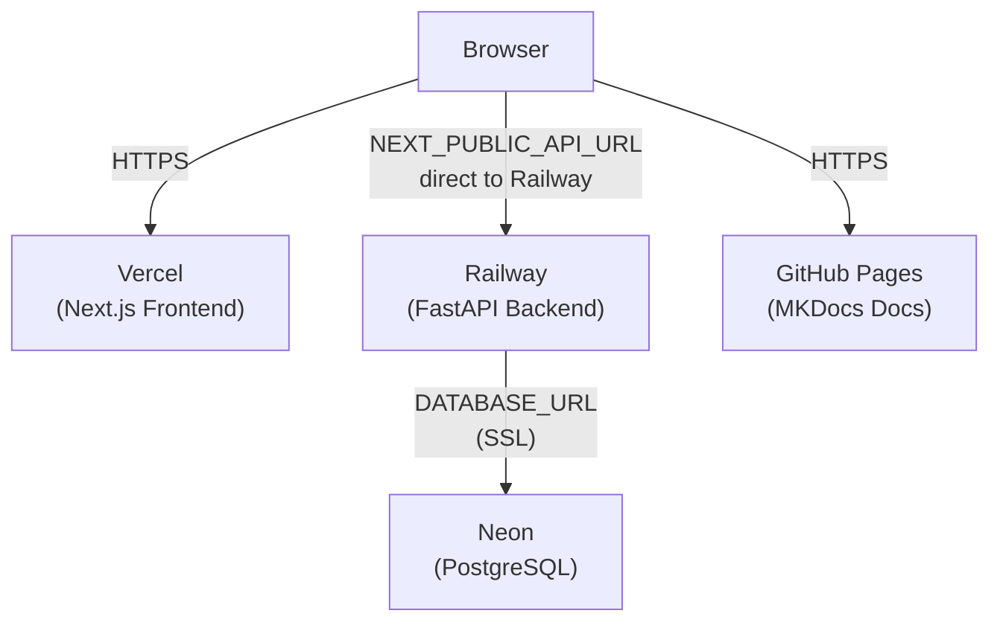

# Deployment

## Production Architecture



| Component | Service | Purpose |
|-----------|---------|---------|
| Frontend | Vercel | Next.js hosting, preview deployments |
| Backend | Railway | FastAPI hosting, env var management |
| Database | Neon | Serverless PostgreSQL |
| Docs | GitHub Pages | MKDocs site |
| CI/CD | GitHub Actions | Lint, test, build, deploy |

## Frontend (Vercel)

1. Connect GitHub repo to [Vercel](https://vercel.com)
2. Configure:
    - **Root directory:** `frontend`
    - **Build command:** `npm run build`
    - **Output directory:** `.next`
3. Environment variables:
    ```
    NEXT_PUBLIC_API_URL=https://<your-railway-backend-url>
    ```
    The browser calls Railway directly — no Vercel proxy or rewrite is used.

## Backend (Railway)

1. Connect GitHub repo to [Railway](https://railway.app)
2. Configure:
    - **Start command:** `uvicorn backend.main:app --host 0.0.0.0 --port $PORT`
3. Environment variables:
    ```
    DATABASE_URL=postgresql+asyncpg://<user>:<password>@<neon-host>/taskmanager?ssl=require
    SECRET_KEY=<random-64-character-string>
    ALLOWED_ORIGINS=["https://<your-vercel-frontend-url>"]
    ACCESS_TOKEN_EXPIRE_MINUTES=30
    ```

## Database (Neon)

1. Create a project on [Neon](https://neon.tech)
2. Copy the connection string (ensure `ssl=require`)
3. Run migrations:
    ```bash
    alembic upgrade head
    ```
4. Seed initial data:
    ```bash
    python -m backend.seed
    ```

## CI/CD (GitHub Actions)

The CI workflow runs on every PR to `main`:

- **Backend:** Install dependencies → run pytest
- **Frontend:** Install dependencies → run tests → build

See `.github/workflows/ci.yml` for the full configuration.

## Generating API Docs

The API reference is auto-generated from FastAPI's OpenAPI schema:

```bash
# Start the backend first
uvicorn backend.main:app --reload

# In another terminal, generate the docs
python scripts/generate_api_docs.py
```

Commit the updated `docs/technical/api/reference.md` with your changes.
